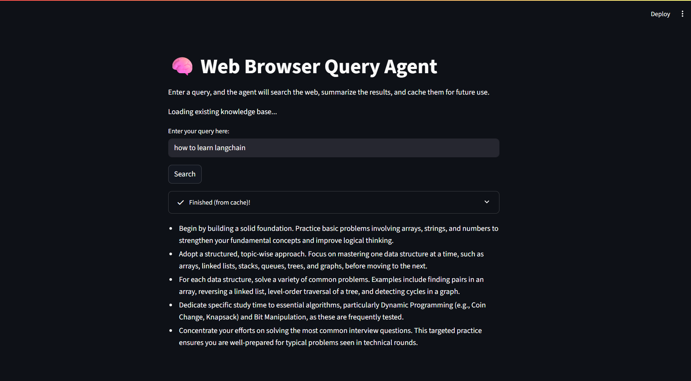

<div align="center">

# 🧠 AI Web Query Agent

[](https://www.python.org/downloads/)
[](https://www.langchain.com/)
[](https://streamlit.io)
[](https://ai.google/)

An intelligent agent that searches the web, summarizes content, and caches results for future use. Built with Google Gemini, LangChain, FAISS, and Streamlit.
</div>



## ✨ Features

-   **🤖 Intelligent Query Validation:** Uses Google's Gemini Pro to determine if a user's input is a valid search query or an invalid command.
-   **⚡ Semantic Caching:** Utilizes a **FAISS** vector database to store summaries. If a new query is semantically similar to a previous one, it retrieves the result instantly from the cache, saving time and API costs.
-   **🌐 Live Web Search & Scraping:** If no similar query is found in the cache, the agent uses DuckDuckGo to perform a live web search and scrapes the top 5 results using **Playwright** for robust content extraction.
-   **📝 AI-Powered Summarization:** Scraped content is summarized by **Google Gemini Pro** using a Map-Reduce chain, ensuring high-quality, coherent summaries even from large amounts of text.
-   **🖥️ Interactive UI:** A clean and user-friendly web interface built with **Streamlit**.

---

## 🏛️ Architecture & Tech Stack

This agent is built on a modern, modular stack, orchestrated by LangChain.

-   **Frontend:** **Streamlit** 🎈
    -   For rapid development of the interactive web UI.
-   **AI Orchestration:** **LangChain** 🦜🔗
    -   Chains together all the components, from validation and caching to scraping and summarization.
-   **LLM & Embeddings:** **Google AI** 🧠
    -   **Gemini Pro** for validation and summarization tasks.
    -   **`embedding-001`** model for creating vector representations of queries for similarity search.
-   **Vector Database:** **FAISS (from Meta AI)** 🔍
    -   A highly efficient, local vector library for storing and searching query embeddings. The FAISS index is saved to the disk for persistence between sessions.
-   **Web Scraping:** **Playwright** 🎭
    -   A powerful browser automation tool used to reliably scrape content from modern, JavaScript-heavy websites.
-   **Search Engine:** **DuckDuckGo Search** 🦆
    -   Used for its scraper-friendly API to fetch search results.


## 🚀 Local Setup and Running the Application

Follow these steps to get the agent running on your local machine.

### 1. Prerequisites

-   [Python 3.9](https://www.python.org/downloads/) or higher
-   [Git](https://git-scm.com/downloads)

### 2. Clone the Repository

Open your terminal and clone this repository:
```bash
git clone <your-repository-url>
cd <repository-folder-name>
```

### 3. Set Up a Virtual Environment

It's highly recommended to use a virtual environment to manage project dependencies.

**On macOS / Linux:**
```bash
python3 -m venv venv
source venv/bin/activate
```

**On Windows:**
```bash
python -m venv venv
.\venv\Scripts\activate
```

### 4. Install Dependencies

Install all the required Python packages from the `requirements.txt` file.

```bash
pip install -r requirements.txt
```

### 5. Install Playwright Browsers

Playwright requires downloading browser binaries. This command will install the necessary dependencies for Chromium.

```bash
python -m playwright install --with-deps
```

### 6. Configure Your API Key

The application needs a Google AI API Key to function.

1.  Get your free API key from **[Google AI Studio](https://aistudio.google.com/app/apikey)**.
2.  Create a new folder named `.streamlit` in the root of your project directory.
3.  Inside the `.streamlit` folder, create a new file named `secrets.toml`.
4.  Add your API key to the `secrets.toml` file in the following format:

    ```toml
    # .streamlit/secrets.toml

    GOOGLE_API_KEY = "your_google_api_key_here"
    ```
    Replace `"your_google_api_key_here"` with your actual key. 

### 7. Run the Application

You're all set! Start the Streamlit server with the following command:

```bash
streamlit run app.py
```

Your web browser should automatically open with the application running at `http://localhost:8501`.

---

## ⚙️ How It Works

The agent follows a precise workflow to handle user requests:

```
graph TD
    A[Start: User enters query in UI] --> B{1. Validate Query w/ Gemini};
    B -- "Invalid (e.g., command)" --> C[Display "Invalid query" error];
    C --> Z[End];

    B -- "Valid (searchable query)" --> D{2. Search Cache (FAISS)};
    D -- "Similar query found" --> E[Fetch cached summary];
    E --> F[Display cached summary to user];
    F --> Z;

    D -- "No similar query found" --> G[3. Perform New Search];
    G --> H[Use DuckDuckGo to get URLs];
    H --> I[Use Playwright to scrape top 5 pages];
    I --> J{4. Summarize Content w/ Gemini};
    J -- "Use Map-Reduce chain" --> K[Generate final summary];
    K --> L{5. Save to Cache};
    L --> M[Add query embedding and summary to FAISS];
    M --> N[Save FAISS index to disk];
    N --> O[Display new summary to user];
    O --> Z;
```

---

## 📁 Folder Structure

```
.
├── .streamlit/
│   └── secrets.toml      # Your secret API keys (not committed to Git)
├── app.py                # The main Streamlit application logic
├── faiss_index_google/   # Folder where the FAISS index is saved
│   ├── index.faiss
│   └── index.pkl
├── requirements.txt      # Project dependencies
└── README.md             # This file
```
